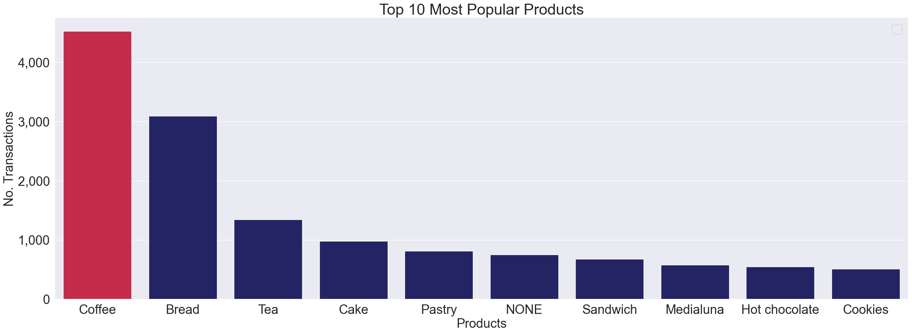
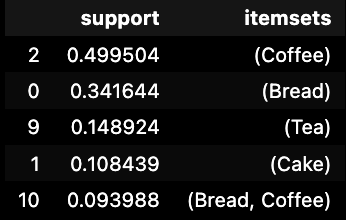
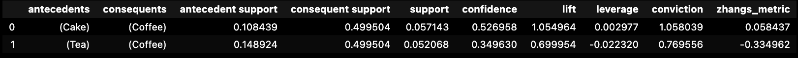
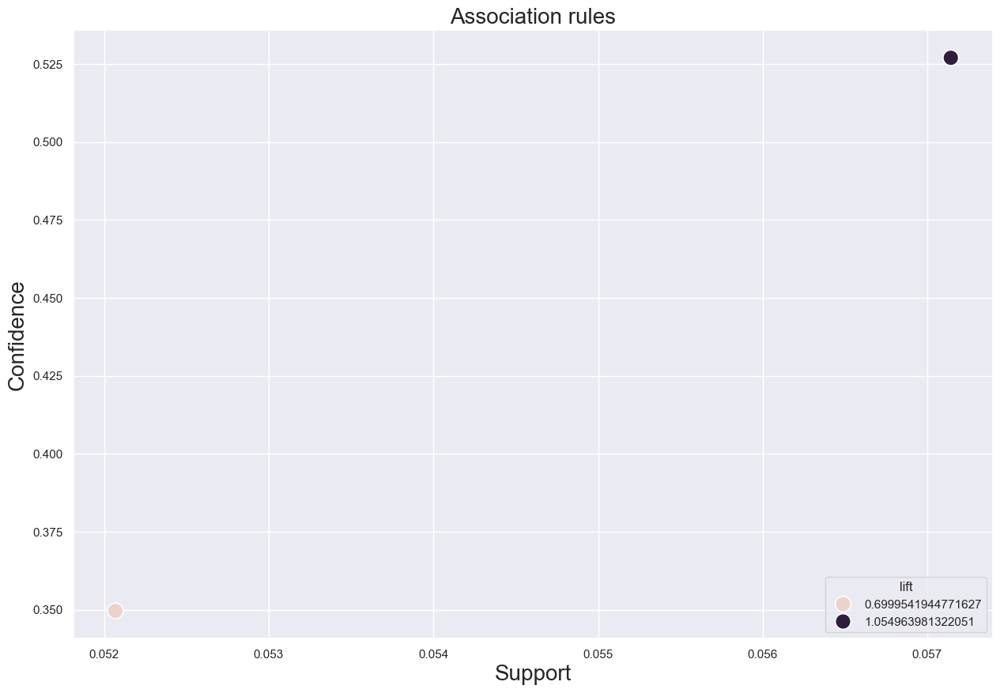

# Market Basket Analysis
## Introduction
Market basket analysis is a technique used to understand the purchase behavior of customers by identifying relationships between different items in their transactions. This analysis is particularly useful for retailers to optimize product placements, design promotions, and improve inventory management.
In market basket analysis, association rules are used to predict the likelihood of products being purchased together. Association rules count the frequency of items that occur together, seeking to find associations that occur far more often than expected.

## Data Description
The dataset used for this project contains transactions from a bakery. Each transaction records the items purchased by a customer at a specific date and time. The essential columns in the dataset are:

- date: The date of the transaction
- time: The time of the transaction
- transaction: The transaction identifier
- item: The item purchased in the transaction

## Analysis and Results

### Top 10 Most Popular Products:
The top 10 most popular products are identified based on the frequency of their occurrence in transactions. This helps in understanding the most demanded items in the bakery.

From the bar chart, we can observe that 'Coffee' is the most popular product, followed by 'Bread', 'Tea', and 'Cake'. This insight is valuable for ensuring these items are always in stock and possibly for creating promotional bundles.

  

### Products (Sorted by Support):
Support is a measure of how frequently an itemset appears in the dataset. Higher support indicates higher popularity of that itemset.
This table provides a sorted view of the itemsets based on their support values. 'Coffee' and 'Bread' are the most frequently appearing items, which corroborates the findings from the most popular products analysis.

  

### Association Rules:
Association rules are generated to identify relationships between items. Key metrics used are:
- Support: The proportion of transactions that contain the itemset.
- Confidence: The likelihood of the consequent item being purchased when the antecedent item is purchased.
- Lift: The strength of the association between two items. A lift greater than 1 indicates a positive association.

Two association rules are identified:
- Customers who bought 'Cake' also bought 'Coffee' with a confidence of 52.7% and a lift of 1.055.
- Customers who bought 'Tea' also bought 'Coffee' with a confidence of 34.96% and a lift of 0.7.

  

### Association Rules Scatter Plot:
This scatter plot visualizes the association rules with support, confidence, and lift metrics.

  

### Conclusion

The market basket analysis of the bakery data provides valuable insights into customer purchasing behavior. The most popular items are identified, and association rules reveal strong relationships between certain products. This information can be leveraged to optimize inventory management, design targeted promotions, and improve overall customer satisfaction.

### Future Work

- Temporal Analysis: Analyze how item popularity and associations change over different times of the day or days of the week.
- Promotion Impact Analysis: Study the impact of promotions on item popularity and association rules.
- Recommendation System: Develop a recommendation system based on the association rules to suggest items to customers during their shopping experience.
